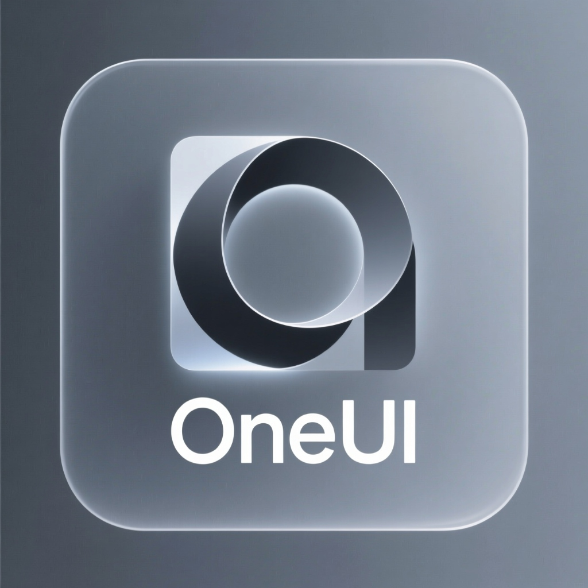

# Laravel OneUI

<p align="center">
    
</p>

<p align="center">
    <a href="https://packagist.org/packages/xbot-my/laravel-oneui"></a>
    <a href="https://packagist.org/packages/xbot-my/laravel-oneui"></a>
    <a href="LICENSE"></a>
</p>

A comprehensive Laravel Blade component library for [OneUI](https://pixelcave.com/products/oneui) Bootstrap 5 Admin Template.

## Requirements

- PHP 8.2+
- Laravel 11.x or 12.x
- OneUI 5.x (purchased separately from pixelcave)

## Installation

```bash
composer require xbot-my/laravel-oneui
```

Publish assets:

```bash
php artisan vendor:publish --tag=oneui-assets
```

## Quick Start

```blade
<x-oneui::page>
    <x-slot:title>Dashboard</x-slot>
    
    <x-slot:content>
        <x-oneui::block title="Welcome">
            Hello, World!
        </x-oneui::block>
    </x-slot>
</x-oneui::page>
```

## Available Components

### Layout
| Component | Usage |
|-----------|-------|
| `page` | Full page layout with sidebar/header |
| `block` | Content block with header |
| `hero` | Hero section |
| `container` | Bootstrap container |
| `row` / `col` | Grid system |
| `offcanvas` | Slide-out drawer |

### Form
| Component | Usage |
|-----------|-------|
| `button` | Buttons with variants |
| `input` | Text inputs |
| `select` | Select dropdowns |
| `checkbox` / `radio` | Form controls |
| `input-group` | Input groups |
| `file-input` | File upload |
| `floating-label` | Floating labels |
| `form` | Form wrapper |

### Data Display
| Component | Usage |
|-----------|-------|
| `table` | Data-driven tables |
| `badge` | Status badges |
| `card` | Cards |
| `pagination` | Paginator |

### Navigation
| Component | Usage |
|-----------|-------|
| `breadcrumb` | Breadcrumbs |
| `nav-tabs` | Tab navigation |
| `sidebar-menu` | Sidebar navigation |
| `nav-item` | Nav menu items |

### Feedback
| Component | Usage |
|-----------|-------|
| `alert` | Alert messages |
| `spinner` | Loading spinners |
| `toast` | Toast notifications |
| `progress` | Progress bars |
| `loading` | Full-screen loader |

### Overlay
| Component | Usage |
|-----------|-------|
| `modal` | Modal dialogs |
| `dropdown` | Dropdown menus |

## Examples

### Button

```blade
<x-oneui::button type="primary">Primary</x-oneui::button>
<x-oneui::button type="success" :outline="true">Outline</x-oneui::button>
<x-oneui::button type="danger" size="lg">Large</x-oneui::button>
```

### Table

```blade
<x-oneui::table 
    :data="$users" 
    :columns="[
        ['key' => 'name', 'label' => 'Name'],
        ['key' => 'email', 'label' => 'Email'],
        ['key' => 'status', 'label' => 'Status'],
    ]"
    :badgeMap="['status' => ['active' => 'success', 'inactive' => 'danger']]"
/>
```

### Grid

```blade
<x-oneui::row gap="3">
    <x-oneui::col md="4">Column 1</x-oneui::col>
    <x-oneui::col md="4">Column 2</x-oneui::col>
    <x-oneui::col md="4">Column 3</x-oneui::col>
</x-oneui::row>
```

### Offcanvas

```blade
<x-oneui::offcanvas id="cart" title="Shopping Cart" position="end">
    Cart content...
    <x-slot:footer>
        <button class="btn btn-primary w-100">Checkout</button>
    </x-slot>
</x-oneui::offcanvas>

<button data-bs-toggle="offcanvas" data-bs-target="#cart">Open Cart</button>
```

## License

MIT License. See [LICENSE](LICENSE) for details.

## Credits

- [Roy](https://xbot.my)
- [OneUI by pixelcave](https://pixelcave.com/products/oneui)
